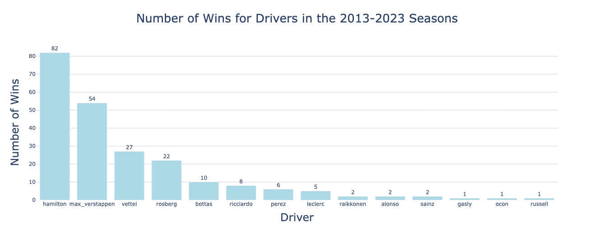
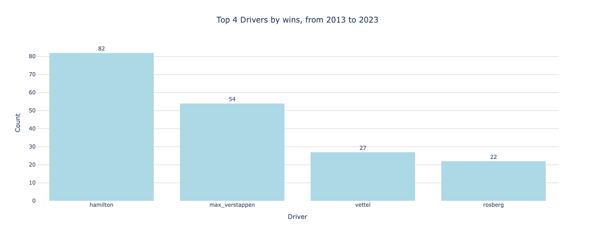
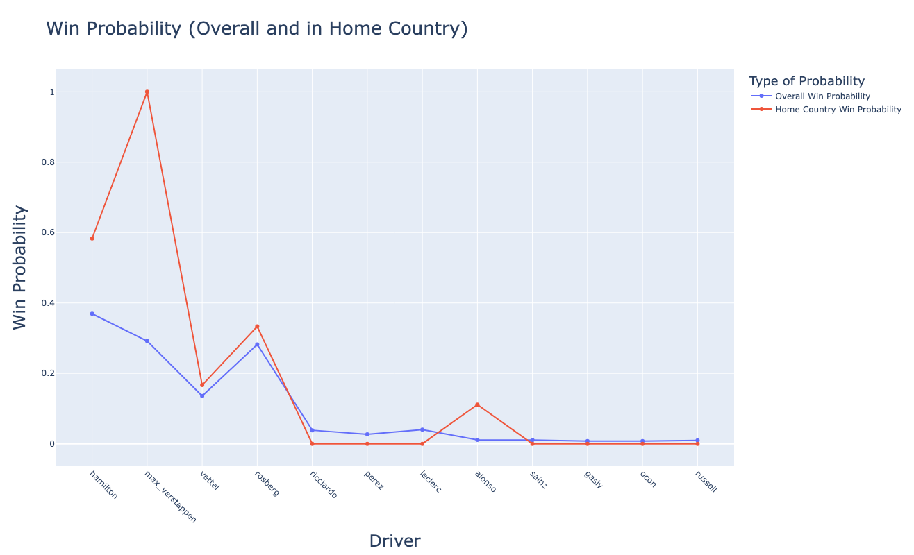
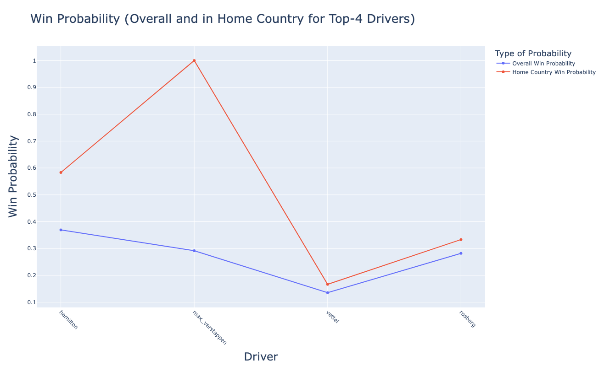
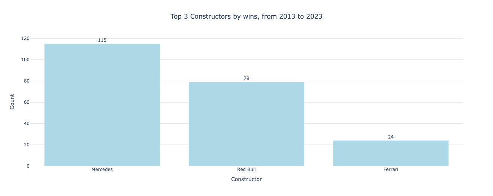
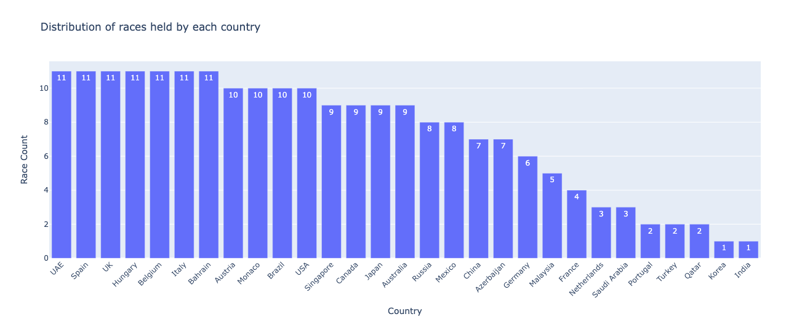
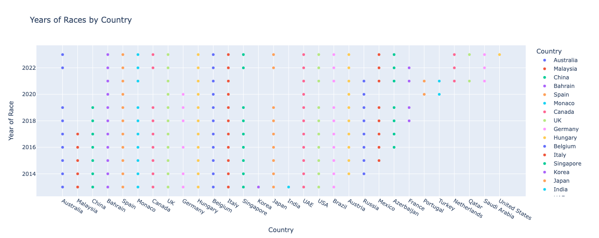

# 🏎️ Formula 1 Fan Hypotheses Analysis (2013–2023)

> A data analysis project exploring some of the most common fan theories in Formula 1 using real race data from 2013 to 2023.

This project uses Python, statistical analysis, and data visualization to test whether popular assumptions about winning races in F1 are actually supported by data. The project is based on the Kaggle dataset "Formula 1 World Championship (1950 - 2024)". 

---

## 📌 Project Goal

Formula 1 fans often debate what factors matter most when it comes to race victories.

This project investigates several common hypotheses, including:

1. 🇬🇧 **Drivers are more likely to win their home Grand Prix**
2. 🏁 **Starting from a higher grid position increases chances of winning**
3. 🚗 **Top constructors dominate race wins**
4. 📈 **Driver ranking strongly correlates with finishing position**

Using historical F1 data, this notebook applies descriptive statistics, visualizations, and hypothesis testing to evaluate these claims.

---

## 📊 Dataset

The project combines multiple Formula 1 datasets, including:

- Race results  
- Driver information  
- Constructors  
- Circuits  
- Races calendar  

Time period covered:

**2013–2023**

---

## 🛠️ Technologies Used

- **Python**
- **Pandas** – data cleaning & manipulation  
- **NumPy** – numerical operations  
- **Matplotlib / Seaborn** – visualization  
- **SciPy / Statistical Methods** – hypothesis testing  
- **Google Colab**

---

## 📈 Key Analysis Performed

### Descriptive Analytics

- Driver participation frequency
- Number of races per country
- Race hosting trends by year
- Constructor participation overview
- Etc

### Relationship Analysis

- Grid position vs finishing position
- Driver rank vs finishing position
- Constructor impact on results
- Nationality vs number of wins/podiums
- Etc

### Hypothesis Testing

Statistical tests were used to determine whether patterns are significant or just random noise.

---

## 📷 Example Insights

- Pole position and front-row starts strongly improve win probability  
- Elite constructors contribute heavily to victories  
- Home race advantage exists emotionally, but statistically may be weaker than fans assume  
- Driver ranking is a meaningful predictor, but race variables still matter

---
## 📊 Visualizations

### Driver Wins: 2013–2023

This chart shows that race wins between 2013 and 2023 were highly concentrated among a small group of drivers, with Hamilton and Verstappen leading by a large margin.

---

### Top 4 Drivers by Wins

The top four winning drivers in the dataset are Hamilton, Verstappen, Vettel, and Rosberg.

---

### Overall vs Home Country Win Probability

This visualization compares each driver’s overall win probability with their win probability in their home country.

---

### Top 4 Drivers: Home Country vs Overall Win Probability

For the top drivers, home-country performance is compared against their general race-winning probability.

---

### Constructor Wins: 2013–2023

Mercedes, Red Bull, and Ferrari dominate constructor wins during the 2013–2023 period.

---
### Race Distribution by Country

This chart shows which countries hosted the most Formula 1 races between 2013 and 2023. Countries such as the UAE, Spain, UK, Hungary, Belgium, and Italy were among the most frequent hosts.

---

### Race Calendar Presence by Year

This visualization maps when each country appeared on the Formula 1 calendar during 2013–2023, highlighting long-term staples and newer additions to the championship schedule.
